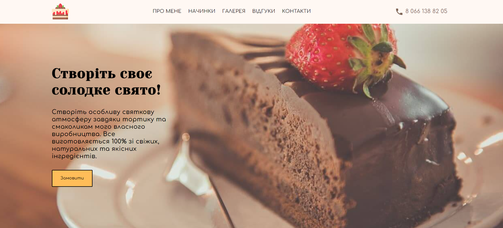
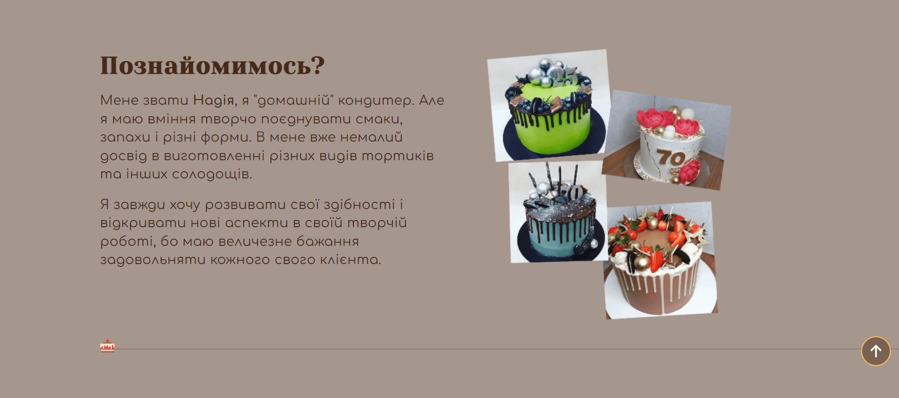
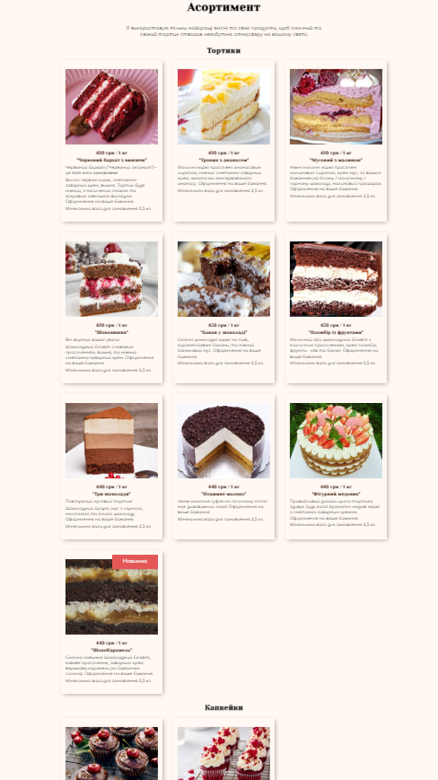
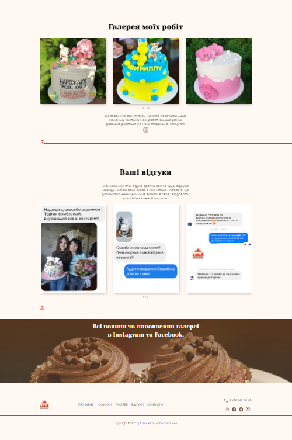

# Cakes

###### Cakes is a landing page - a business card for confectioner Nadezhda.

## Table of Contents

- [Installation](#installation)
- [Overview](#overview)
- [Features](#features)
- [Technologies Used](#technologies-used)
- [Demo](#demo)
- [Screenshots](#screenshots)
- [License](#license)
- [Contact](#connect-with-me)

## Installation

Install locally via HTTPS or SSH.

## Overview

<image align="right" src="./images/icons/favicon/favicon.png" alt="Logo" width="100" height="100">

**Cakes** is an application developed for amateur pastry chef Nadezhda, with a pleasant and
user-friendly interface. Here you can get to know Nadya better, view a gallery of her works, read
reviews about products and choose and order a cake or cupcakes for yourself.

The application includes a header, a main section with an “Order” button, and sections with
information about the author, the entire range with current prices, examples of work and product
feedbacks. The footer contains all contact information for communication.

In addition, users can view contact information to communicate with the pastry chef through a modal
window and "Scroll to top" button for user convenience.

## Features

- Desktop, tablet, mobile - **adaptive layout**
- **BEM methodology**
- Using **Mobile First method**
- **SASS preprocessor**

- Header for easy navigation and mobile menu
- Hero section with a "Order" CTA button
- Modal window with information for communication
- "About" section
- "Menu" section
- "Options" section
- 'Feedback' section
- Sliders with an options and feedbacks using **Swiper**
- Footer with contact information
- "Scroll to top" button for user convenience

## Technologies Used

## Demo

[Demo](https://sokolova88.github.io/Cakes/)

## Screenshots

 _Caption for Screenshot 1 - Hero Section_
 _Caption for Screenshot 2 - About Section_

  
  

_Caption for Screenshot 4 - Last Sections_

## Issues

If you encounter any issues or have suggestions, please
[open an issue](https://github.com/Sokolova88/Cakes/issues).

## License

This project is licensed under the [MIT License](LICENSE).

## Feedback

I welcome feedback and suggestions from users to improve the application's functionality and user
experience.

## Languages and Tools:

## Connect with me:

